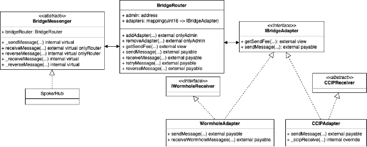
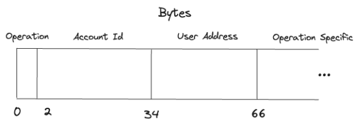

Cross-Chain Lending Protocol Design

The motivation for building a Cross-Chain Lending Protocol (xLending for shorthand) is simple.

- The most important factor for a lending protocol's success is liquidity. If there are stablecoins deposited, users will inevitably borrow them. By connecting to more Blockchains, the opportunity and ease at which stablecoins can be supplied increases.
- Users choose for convenience. A user wants to interact with a protocol from their favourite wallet and the chains they are most familiar with. In general a Cross-Chain protocol has lower barriers to entry for this reason.

A distinction to be aware of is the difference between “Cross-Chain” and “Multi-Chain”. “Multi-Chain” refers to deploying the same protocol on multiple Blockchains whereas “Cross-Chain” refers to deploying a single protocol which can be accessed through multiple Blockchains. 

A “Multi-Chain” protocol solves the convenience problem because a user can choose the specific instance of the protocol they want to use based on the Blockchain it’s deployed on. However a “Multi-Chain” protocol doesn’t fully solve the issue of liquidity. With “Multi-Chain”, there are a number of protocol copies, each isolated from each other so deposits on one protocol cannot be borrowed on another. With “Cross-Chain”, all the liquidity is available irrespective of which chain you are on. This makes “Cross-Chain” much more capital efficient compared to “Multi-Chain”.

Another benefit of “Cross-Chain” over “Multi-Chain” for Lending Protocols in particular, is that users can use funds deposited on one chain as collateral to borrow other funds on a different chain. Otherwise, the same user would have had to bridge over their collateral to the chain which they want to borrow from, and identify a lending protocol which accepts their wrapped assets. This process can be tedious and in some cases outright impossible.

# Hub & Spoke Architecture
We will use the “Hub & Spoke” model. There will be a series of “Spokes” that connect outlying Blockchains to a central “Hub” Blockchain. Below is a diagram illustrating the architecture.

The Hub Chain and Spoke Chains communicate back and forth using a Generic Messaging Protocol (GMP). In our case the GMPs which we will be using are Wormhole and Chainlink CCIP.

The whole state of the protocol is stored on the Hub Chain. There will be zero state stored on the Spoke Chain as it relates to the Lending Functionality (there will be state related to areas like how to communicate to the Hub Chain). The primary reason for this decision is to avoid all concerns of state asynchronicity and race conditions between chains.
# To Bridge or Not To Bridge
We saw how the protocol state lives solely on the Hub Chain. However there is the additional question of whether the protocol tokens are bridged to the Hub Chain or whether they remain on their respective Spoke Chains.

Considering both the pros and cons of bridging, we decided to take a hybrid approach. Some tokens will be bridged to the Hub Chain and some tokens will remain on their respective Spoke Chain.

Tokens such as USDC and other cross-chain native tokens will be bridged to the Hub Chain. The bridge used will be dependent on the token and will be based on which bridge does not lead to a wrapped version of the token. For example, we will use Circle CCTP to facilitate the cross-chain native transfer of USDC. Users will be able to deposit and borrow these tokens from any of the supported Spoke Chains (assuming the token and bridge pair supports the desired Blockchain).

Tokens such as AVAX and other Spoke gas tokens will remain on their respective Spoke Chain. Users will only be able to deposit and borrow these tokens from the Spoke Chain which they originate from. 

If a user would like to receive these tokens on a different Spoke Chain, then they must take the additional step of bridging them over after they have received them on the other Spoke Chain.
# Cross-Chain Communication and Finality
Some blockchains don’t define who the next block proposer is, and the ones which do, need to define how to recover if the proposer is offline. This can lead to situations where the network can fork (where there are two or more valid blocks), and the network must agree on which fork to build upon.

Forks can last for multiple blocks where different parts of the network disagree on the main chain. Eventually the fork will be resolved according to the rules of the blockchain, however all the transactions which were included in the discarded blocks, will be expunged. This process is called a re-org.

Re-orgs are expected but measures must be taken to prevent attackers from exploiting re-orgs by performing double spend attacks. Imagine a user is bridging USDC from Ethereum to Avalanche. They submit a transaction to burn USDC on Ethereum and the bridge mints USDC on Avalanche after the block with the transaction is added to the Ethereum chain. Now Ethereum re-orgs, and the burning transaction is removed from the chain. The attacker can now spend their USDC on both Ethereum and Avalanche.

To avoid the above situation, we must consider the concept of finality. Finality is a broad concept but its general meaning is when a transaction is considered final and cannot (or is probabilistically very unlikely to) re-org.

It isn’t just bridges which have to be concerned about re-orgs; also we do! When a user deposits funds on a Spoke Chain, they are credited in their Folks Finance account on the Hub Chain. If a re-org happens in the Spoke Chain after their account has been updated, such that their funds were never received by the smart contract, the user has successfully carried out a form of double spend attack. From this example, we see more broadly that the double spend attack not only applies to bridging tokens but applies to bridging “value” more broadly. Finality must be achieved on the Spoke Chain for the deposit and repay operations. Finality must be achieved on the Hub Chain for the withdraw and borrow operations.

The below diagram shows that the deposit message is not relayed from the Spoke Chain to the Hub Chain until the block containing the deposit is finalised.

## When We Don’t Care about Finality
For certain operations, specifically when no “value” is being transferred, whether finality is met or not is irrelevant. In those cases, you may as well relay the messages immediately for a better user experience: no waiting is needed and you won’t need to resubmit the original transaction if it gets expunged from the network.

For example, one operation we have in our protocol is “Invite Address”. We will explore this operation later in the document but for now, its purpose is to add an additional address from a different chain to your Folks Finance Lending Account. After it has been added, the new address can manage your account as any other address could, i.e. withdraw, invite other addresses etc.

Imagine a user submits an “Invite Address” transaction from a Spoke Chain. We don’t wait for finality and immediately relay the message to the Hub Chain. The Hub Chain updates its state with the new information. Now it comes to be that the Spoke Chain re-orgs and the source transaction is expunged from the network. 

The fact that the transaction was expunged from the Spoke Chain has no bearing on the protocol as the purpose of the source transaction was to indicate the intentionality of the user that they would like to add a new address to their account. The source transaction hasn’t a value attached to it so there’s no danger of a double spend attack.

This principle of ignoring finality applies to many operations in the protocol. In fact, you don’t need to wait for even parts of the withdraw and borrow operations. A user could submit a borrow operation on Spoke Chain A, requesting to borrow ETH from Ethereum. 

Here we don’t wait for finality for the transaction indicating the request to borrow 1 ETH because again, the source transaction is solely used to define a user’s intention. Contrast this with the message from the Hub Chain to the Spoke Chain, for that we must wait for finality. This is because the message encodes a value transfer. The Hub Chain has updated its state to indicate that the user has borrowed an additional 1 ETH. If this transaction was expunged from the Hub Chain after the user has received their 1 ETH, the user has successfully carried out a form of double spend attack whereby they can use their very same deposits to borrow more funds or withdraw them entirely.

Currently CCIP doesn’t allow you to specify the level of finality to wait for for the source chain transaction. Therefore we will by default use Wormhole for these types of transactions until the same has been implemented on CCIP.
# Cross-Chain Messaging Architecture
The Cross-Chain Lending Protocol supports sending messages through either Wormhole or Chainlink CCIP. 

When a user initiates a transaction from a Spoke Chain, they specify which GMP they want to relay their message using. Note that some GMPs may not support all operations in which case the user is restricted in their choice. The frontend will also default select a GMP for certain operations when one GMP provides a superior user experience compared to another.

The design is intended to be flexible such that it can upgrade to the latest version of a GMP, remove GMPs which are vulnerable and add new GMPs in the future. Ease of integration was also considered.

The abstract contract *BridgeMessenger* enables its inheritors the ability to send and receive messages. A Spoke/Hub smart contract doesn’t need to know the internal details of how their message will be delivered or received, rather it can just focus on the usage.

The contract *BridgeRouter* abstracts away the differences between the available GMPs (in our case Wormhole and Chainlink CCIP). It contains a mapping of the GMPs. It also supports adding new GMPs and removing existing GMPs. The *BridgeRouter* responsibilities include:

1. Routing a requested message to send through the GMP which was specified.
1. Forwarding a received message to the desired smart contract.
1. Storing failed messages to be retried/reversed.

The interface *IBridgeAdapter* specifies the implementation needed of a GMP for it to be callable by *BridgeRouter*. Each GMP will have its own adapter specific to its needs. A GMP may have multiple adapters to support various functionality such as sending data alone or sending data + token.

The *WormholeAdapter* implements *IBridgeAdapter* and [*IWormholeReceiver*](https://github.com/wormhole-foundation/wormhole-relayer-solidity-sdk/blob/main/src/interfaces/IWormholeReceiver.sol). It accepts messages to send from *BridgeRouter* and uses the Wormhole Automatic Relayer to do so. It also receives messages sent from a different chain (which were sent from the Wormhole Automatic Relayer) and modifies the data to be in a common format for *BridgeRouter.*

The *CCIPAdapter* implements *IBridgeAdapter* and inherits from [*CCIPReceiver*](https://docs.chain.link/ccip/api-reference/ccip-receiver). It accepts messages to send from *BridgeRouter* and uses Chainlink Relayer to do so. It also receives messages sent from a different chain (which were sent from the Chainlink relayer) and modifies the data to be in a common format for *BridgeRouter.*

There is a single instance of *BridgeRouter* and each adapter deployed on all the Spoke Chains and the Hub Chain. An adapter will not be deployed if the corresponding GMP is not supported on that Blockchain.
## Sending a Message
To send a message, it is necessary to implement *BridgeMessenger* and call the \_*sendMessage* function. It has parameters:

|**Name**|**Type**|**Description**|
| :- | :- | :- |
|params|MessageParams|
The message parameters relating to how to send the message and with which configuration. It includes:

- adapterId, uint16: The identifier for the adapter to use for the initial message

- returnAdapterId, uint16: The identifier for the adapter to use for the return message

- receiverValue, uint256: The amount of value to attach to the delivery transaction

- gasLimit, uint256: The maximum amount of gas the relayer can consume to execute when calling the receiver smart contract located on the destination chain

- returnGasLimit, uint256: The gas limit to use for the return message
|
|sender|bytes32|
The source address which sent the message.

Typically will be either the spoke or hub contract address.
|
|destinationChainId|uint64|
The identifier for the destination chain.

Each GMP has their own dictionary of chainIds so *BridgeRouter* defines* its own dictionary and has a mapping between its chainIds and each respective GMP’s chainIds.

The chain identifier will be for the Hub Chain if the message is being sent from a Spoke Chain, and will be a Spoke Chain if the message is being sent from the Hub Chain.
|
|handler|address|
The address which will handle the received message on the destination chain.

This address is different to that of the receiver. The receiver is the address which receives the message from the relayer whereas the handler is the address where the message is forwarded to so some action can take place based on the message content.
|
|payload|bytes|The data to send. The payload will be different depending on the operation called.|
|finalityLevel|uint8|
The level of finality to wait for before the message can be received on the destination chain.

The parameter will be ignored if the user is using an adapter which doesn’t have this feature.
|
|extraArgs|bytes|Configurable parameter to remain upgradeable. The value will be set when sending tokens.|

To understand internally how the message is sent, we will look at an example message lifecycle.

The user submits an “Invite Address” transaction to the Spoke Chain and passes an identifier to signal the intention to use CCIP for the Cross-Chain communication.

The implementation of the “Invite Address” operation requires a message to be sent to the Hub Chain. Therefore the *Spoke* calls *BridgeRouter* with the following parameters:

|**Name**|**Type**|**Value**|
| :- | :- | :- |
|params|MessageParams|
adapterId, uint16: CCIP adapter identifier

returnAdapterId, uint16: 0

receiverValue, uint256: 0

gasLimit, uint256: Custom specified gas limit

returnGasLimit, uint256: 0
|
|sender|bytes32|Spoke smart contract address.|
|destinationChainId|uint64|Hub chain identifier.|
|handler|bytes|Hub smart contract address.|
|payload|bytes|Data encoding request of user to add X address to their account.|
|finalityLevel|uint8|Ignored since CCIP doesn’t support this feature.|
|extraArgs|bytes|Empty|

The *BridgeRouter* receives the request and verifies the original sender is valid. It then forwards the message to *CCIPAdapter*.

Lastly, *CCIPAdapter* receives the forwarded message and verifies the sender is *BridgeRouter.* It then* modifies the message to be in the format needed for CCIP before sending the message to the corresponding CCIP adapter on the Hub Chain.
## Receiving a Message
To receive a message it is necessary to implement *BridgeMessenger* and *\_receiveMessage* function. The *\_receiveMessage* function* encodes the logic regarding how to handle a received message. It has parameters:

|**Name**|**Type**|**Description**|
| :- | :- | :- |
|messageId|bytes32|Unique identifier for message when combined with adapter.|
|sourceChainId|uint16|The chain where the message was sent from.|
|sourceAddress|bytes32|
The address where the message was sent from.

The source address will be the spoke/hub on the source chain, not the user address which initiated the operation.
|
|handler|bytes32|
The address of the smart contract to handle the message received.

The value should be the same as the context smart contract address.
|
|payload|bytes|
The data received. 

The payload will be different depending on the operation called.
|
|returnAdapterId|uint16|If applicable, where to route the return message through.|
|returnGasLimit|uint256|If applicable, the gas limit for the return message.|

To understand internally how the message is received, we will look at an example message lifecycle.

The “Invite Address” transaction sent from the Spoke Chain is received on the Hub Chain. The Chainlink Relayer calls *ccipReceive(...)* of *CCIPAdapter* which verifies the message sender is valid. A sender is considered valid if it originates from a corresponding *CCIPAdapter* on one of the spoke chains. The adapter then modifies the message to be in a common format for *BridgeRouter* and calls its *receiveMessage(...)* function.

The *BridgeRouter* verifies the message received comes from a known adapter. Before forwarding, the *BridgeRouter* stores the (adapter identifier, message identifier) pair and message in a mapping. This serves two purposes:

1. It ensures the same message cannot be received twice. 
1. On occasion, messages which fail in the handler are recorded so they can be later retried or used for recovery - see the [following section](#kix.qsof27fovyus) for more details.

Because we are saving messages in the *BridgeRouter* and not the individual adapters, the design of the adapters must ensure that the same message cannot be replayed through different adapters.

Lastly, the *receiveMessage()* function of *BridgeMessenger* is called which verifies the caller is the *BridgeRouter*. It then internally calls the overridden *\_receiveMessage()* function of *Hub*. The *\_receiveMessage()* function is free to handle the message however it sees fit.
## Round Trip Messages
GMPs charge a fee when sending a message. The fee includes the following considerations:

- Base fee for sending messages.
- If using automatic relayer, fee for gas cost when receiving message.
- If using automatic relayer and if specified, fee for attaching value when receiving message.

The fee is generally paid using the native gas token of the source chain. 

Some operations require a round trip of messages. 

1. An operation is initiated from the Spoke Chain.
1. A message is sent from the Spoke Chain to the Hub Chain.
1. A message is received on the Hub Chain.
1. A message is sent from the Hub Chain back to the Spoke Chain.
1. A message is received on the Spoke Chain.

How do you pay for the fee involved in step 4? The answer is that you can pay a higher fee in step 2 so that a value is attached in step 3, to be spent on step 4. This mechanism is supported by Wormhole but not CCIP. 

In particular, each user will have a balance on the Hub Chain which they can spend from to send messages back to the Spoke Chains. When initiating an operation from a Spoke Chain, the user will have the option to pay an additional fee to increase their balance on the Hub Chain.  Alternatively, they can choose to use their existing balance or a combination of the two by paying no or some additional fee.

We also define a user balance on the Spoke Chain so that if the user overestimates the required fees, the additional value is saved for them to be used or withdrawn later.
## Messaging Schema
When receiving a message, GMPs provide some common parameters such as a message identifier, the source chain and the source address of a message. Since these are all included already, we don’t explicitly incorporate them into the messaging schema.

The first two bytes encode the type of operation associated with the message. The next 32 bytes indicate the account id associated with the message. The next 32 bytes indicate the user address associated with the message. Note that this is different from the message sender since messages are broadcasted from an *IBridgeAdapter*. Lastly the next undertimed set of bytes are specific to the operation e.g. a deposit operation will use these to encode details like the amount deposited. 
## USDC Transfers
In the section “[To Bridge or Not To Bridge](#kix.ecyihj8ucq9n)”, we spoke about the hybrid approach we are taking when it comes to token transfers. Tokens such as USDC and other cross-chain native tokens will be bridged to the Hub Chain, while all other tokens will remain on their respective Spoke Chain.

We will use Circle CCTP to facilitate the Cross-Chain native USDC transfers.  Circle CCTP the [*depositForBurn*](https://developers.circle.com/stablecoins/docs/evm-smart-contracts#depositforburn) function which burns USDC on the source chain and then mints USDC on the destination chain. The USDC minted will be transferred to the *mintRecepient*. The [*depositForBurnWithCaller*](https://developers.circle.com/stablecoins/docs/evm-smart-contracts#depositforburnwithcaller) has the restriction whereby only the *destinationCaller* address is able to call the function on the destination chain to mint the USDC.

In our protocol the transfer of USDC is coupled with an operation in the protocol e.g. deposit USDC. Therefore we want the atomic execution of receiving the message encoding the operation and the minting of USDC. This is why we use the *depositForBurnWithCaller* function, specifying the *destinationCaller* to be the same address as the GMP message *handler*.

Chainlink CCIP automatically handles the USDC transfer internally for you so you can use their native support for token transfers like you would do for any other token.

Since we are receiving both a GMP message and CCTP message, we must wait for finality on both before relaying the message (attestation for CCTP). 

## Adapters
The adapters are responsible for sending and receiving messages from a given GMP. There will be an adapter for each GMP supported and it must be deployed on both the source and destination chain of the message.

A GMP may have multiple adapters in order to support certain types of operations or functionality. For example, if a user wants to relay the Wormhole message coupled with a Circle CCTP transfer then they can call the specific adapter which implements that.

The adapters check the message is from a known source chain + address, and it’s correctly formatted. It then forwards the message to *BridgeRouter* with the same parameters as we saw in [Receiving a Message](#kix.wx99r9lzotv1).
### CCIP Adapter
The contract *CCIPAdapter* inherits from [*CCIPReceiver*](https://docs.chain.link/ccip/api-reference/ccip-receiver) and overrides the function \_*ccipReceive(...)*. It receives the message in the format [*Client.Any2EVMMessage*](https://docs.chain.link/ccip/api-reference/client#any2evmmessage) before converting it into the common format needed for *BridgeRouter*.
### Wormhole Adapter
The contract *WormholeAdapter* implements [*IWormholeReceiver*](https://github.com/wormhole-foundation/wormhole-relayer-solidity-sdk/blob/main/src/interfaces/IWormholeReceiver.sol) and the function *receiveWormholeMessages(...)*. It receives the message as *bytes* before converting it into the common format needed for *BridgeRouter*.. 

The *WormholeAdapter* also has the added ability to specify the level of finality to wait. Operations involving no value transfer will make use of this to ensure there is no unnecessary delay to relaying messages.

We saw in the “[USDC Transfers](#kix.jn77nro15yd)” section that we will also have a second version of the *WormholeAdapter* to support CCTP atomic transfers.
### Hub Adapter
The *HubAdapter* mimics the behaviour of sending and receiving messages. It is used when the source and destination chains of a message both refer to the Hub Chain. Instead of waiting for a message to be relayed, once a message is sent, it is immediately received. The purpose of the *HubAdapter* is to ensure the interaction with the Hub Contracts remains the same regardless of where the operation is coming from.

# Rate Limit on Cross-Chain Value Transferred
To minimise risk and limit any potential losses, we impose rate limits on the maximum amount that can be taken out of the protocol in a given time period. A *RateLimited* smart contract will be deployed on all Spoke Chains for each of its supported tokens. 

The *deposit* and *repay* operations entail value being transferred from a Spoke Chain to the Hub Chain. They result in the capacity within the time period increasing. The *withdraw* and *borrow* operations entail value being transferred from the Hub Chain to a Spoke Chain. They result in the capacity within the time period decreasing.

To implement the rate limiting, we define for each token the following parameters:

|**Name**|**Type**|**Description**|
| :- | :- | :- |
|period|uint32|The period number we are in. If the period length is defined for example as one day, then each new day would increment the period number be 1. |
|limit|uint128|Maximum value that can be consumed per period.|
|capacity|uint128|The actual capacity remaining within the bucket. Will be reset to the limit on each new period.|

Below is an example illustration of the rate limiting mechanism.

An implication to be aware of is the existence of the rate limiter may prevent a user from withdrawing or borrowing (or performing any of the other operations involving a value transfer out of the protocol). An attacker could execute a denial of service attack by maliciously *depositing* before a new period, then immediately *withdrawing* once the new has started. 

To combat this issue, the limits will be set sufficiently high such that it would require the attacker having a sufficient amount of liquidity to execute. In addition, a “hot wallet” will have the ability to temporarily boost capacity in the current period if we notice this behaviour.

The *RateLimiter* is unaware of the price of a token so periodically the parameters of each bucket should be adjusted as to set an appropriate balance between usability and security.
# Account Management
We define an account to be a user’s Folks Finance Account which contains all the information regarding their positions and facilitates lending functionality given their assets. Accounts are managed using Blockchain Addresses. Each account has a unique *bytes32* identifier. 

The challenge is how do you do account management in a cross-chain world? A user wants to manage their account using multiple Blockchains. 

We identify an address using the tuple *(chain identifier, chain address)*. The combination of these two properties uniquely identifies a single entity with no overlapping. To support any address format, we use the type *bytes32* in place of *address*. 

To simplify the user experience, we restrict an account to have at most one address registered per Spoke Chain. We can therefore assume that if a user is for instance borrowing ETH, they should receive the ETH in their registered Ethereum address without requiring the user to specify which registered Ethereum address. 

Another limitation we impose is that the same *(chain identifier, chain address)* pair cannot be registered to multiple accounts. This is to prevent the scenario where a user is interacting with the protocol without realising they are on a different account which can lead to confusion. The one account per address gives rise to a possible denial of service attack where someone could add an address you control to their own account, preventing you from using the same account for yourself. Therefore we use the concept of inviting and accepting. An existing registered address of an account can “invite” another address from a different Spoke Chain to their account. The address recipient of the invite must then “accept” the invitation before they become registered to the account.

## Delegatable 
To allow for composability and for other protocols to build on top of the Cross-Chain Lending Protocol, we enable another set of addresses the ability to manage accounts. We call these addresses “delegated addresses”. They can only be used from the Hub Chain and an account can add as many of them as they like to their account. The same address can be delegated to by multiple accounts as well.

It is intended for these addresses to be other smart contracts on the Hub Chain which use the Cross-Chain Lending Protocol under the hood. See the [following section](#kix.37ob22z5oizs) for more details.
# Lending Model
Folks Finance already has a sophisticated and established Lending Protocol on the Algorand Blockchain. The new Cross-Chain Lending Protocol will broadly take the same design. For completeness, we will give an overview of the lending model used but it is recommended to review the Folks Finance Lending V2 on Algorand for a comprehensive understanding.
## Interest Rates
The user is able to borrow with a variable interest rate or stable interest rate. A variable rate is when interest a user pays continually varies with market dynamics. Whereas with a stable rate, a user locks in an interest rate at the time of borrowing. Note that a stable rate is not to be confused with fixed rate, because in some cases it will be necessary to rebalance the rates of existing loans to ensure the security and affordability of the protocol.

The deposit interest rate which the user earns does vary with market dynamics and comes from the interest paid by borrowers. 
### Utilisation Ratio
To determine the interest rates set we define the *utilisation ratio*, U. It is a measure of how much of a pool has been borrowed compared to deposited. 

U=TotalVariableBorrowAmount+TotalStableBorrowAmountTotalDeposits
### Borrow Interest Rates
To differentiate the variable parameters from the stable ones, we are going to use the subscript ‘*s’* for stable and ‘*v’* for variable. We also introduce the variable ratio to monitor the weight of the stable borrows compared to the total debt as a whole. 

ratio=TotalStableBorrowAmountTotalVariableBorrowAmount+TotalStableBorrowAmount

The variable interest rate, ivb, and stable borrow interest rate, isb, are then calculated based on an optimal utilisation ratio UOpt  and optimal stable to total debt ratio Oratio set by the protocol. The constants Rv/s x are parameters set by the protocol to manage the interest rates as well.

ivbt=Rv0+ UtUOpt\*Rv1 , if Ut<UOpt

ivbt=Rv0+Rv1+ Ut- UOpt1-UOpt\*Rv2, if Ut≥UOpt

isbt=Rv1+Rs0+ UtUOpt\*Rs1 , if Ut≤UOpt

isbt=(Rv1+Rs0)+Rs1+ Ut- UOpt1-UOpt\*Rs2, if Ut>UOpt

If ratio>Oratio, an excess is added to the stable borrow interest rate:

isbt+=Rs3\* ratio- Oratio1-Oratio 

Below is a visualisation of how the interest rates change with the utilisation ratio.

### Deposit Interest Rate
The general idea behind the deposit interest rate is the cumulative interest paid by borrowers are distributed proportionately to depositors based on the amount they’ve deposited, subtracting a fixed percentage kept as a fee by the protocol.

The deposit interest rate idt is directly dependent on the overall borrow interest rate ibt. Before we can calculate ibt, we must first calculate the overall stable borrow interest amount Osbt; the sum of the stable borrowed amounts multiplied by their respective interest rates.

Osbt=Bi\*isbi

Where:

- Bi is the stable borrow amount
- isbi is the stable borrow rate
- the subscript i represents each stable borrow taken on the protocol.

The overall borrow interest rate factors in all variable and stable rate borrows and is calculated by taking the weighted average of the total variable and stable borrowed amounts and their respective interest rates.

ibt=VBA\*ivbt+OsbtTotalDebt

For the deposit interest rate idt, the borrow interest ibtis divided between the depositors, excluding what is retained by the protocol. The variable RR is the retention rate i.e. the interest kept by the protocol as revenue.

idt= Ut\*ibt\*(1-RR)
### Rebalancing

Although a user locks in a borrow interest rate when stable borrowing, under certain conditions, it may be necessary to rebalance their borrow interest rate. Rebalancing means that the user’s stable borrow interest rate is updated to the pool’s current stable interest rate isbt.

To rebalance the stable rate down, the user’s loan stable rate isbold needs to be greater than the current stable rate isbt plus a delta, for instance ∆=20%.

` `isbold≥ isbt\*1+∆ 

To rebalance the stable rate up, two conditions have to be met. The first requires the utilisation ratio to be greater than or equal to a given threshold, for instance URU=95%. The second requires the deposit interest rate to be less than or equal to a given percentage of the max variable interest rate, for instance DIRRU=25%.

Ut≥URU

idt≤DIRRU(Rv0+Rv1+Rv2)
## Collateral
For safety reasons, the total amount that can be borrowed has to be less than the value of the collateral, in case of negative fluctuations in the collateral value and to guarantee the interest payment.

The collateral factor CF represents how much a user can borrow against the collateral supplied to the protocol, in percent terms. For example, a more stable asset such as USDC may have CF=80% (for $10 supplied, up to $8 of value can be borrowed against it) whereas ALGO may have CF=60%.

Consider a user who deposits multiple assets and uses them as collateral for a loan. The borrowable amount BAt at time t for a given loan’s collateral balance is:

BAt=i=ASSETcollateralAti\*Pi\*CFi

Where:

- Ati denotes the current user collateral balance if they were to withdraw the fToken.
- Pi is the price of the collateral asset
- CFi is the collateral factor 
- the subscript i represents each collateral of the loan.

Since the collateral is composed of different assets, the maximum borrowable amount of each collateralized token must be computed and summed together. 
## Borrow
After a user has locked up their collateral, they can borrow against it. The amount the user has borrowed of a given asset is defined as Bt whereas the borrow balance of a given asset BBt is defined as the amount borrowed plus accrued interest.

When a user first borrows, we have:

Bt=BBt

One thing to note is that when a user borrows with a stable rate, they lock in the current stable rate of the pool. However users will only be able to borrow up to a percentage of the available liquidity at the current stable borrow rate. This is to avoid that a specific borrower would borrow too much available liquidity at a too competitive rate.

When a borrow is changed by an amount C e.g. a user increases or repays their existing borrow, the borrow balance updated:

BBt=BBt-1\*IbtIbt-1±C

The accrued interest AIt is defined as the difference between the borrow balance BBt and the borrowed amount Bt:

AIt=BBt-Bt

When a user repays their borrow, a portion of the accrued interest is retained AItR by the protocol:

AItR=AIt\*RR

Where:

- RR is the retention rate i.e. the interest kept by the protocol as revenue.

When a user increases their borrow by an amount C, the updated borrowed amount Bt is:

Bt=Bt-1+C

When a user repays their borrow by an amount C, the updated borrowed amount Bt is:

Bt=Bt-1-max0, C-AIt 

When a user rebalances or switches between variable and stable rate borrow in either direction, the borrowed amount Bt remains the same:

Bt=Bt-1

If a user increases their stable rate borrow by an amount C, their new interest rate isbnewis updated using a weighted average of the interest rate of their existing borrow  isbold and the pool’s current stable borrow rate:

isbnew=isbold\*BBold+isbt\*CBBold + C

Where:

- BBold=BBt-1\*IbtIbt-1 

The borrow factor BF represents the effective borrowed amount given a borrow, in percent terms. For example, a more volatile asset such as ALGO may have BF=110% (for $10 borrowed, it is as if $11 has been effectively borrowed) whereas USDC may have BF=100%.

Consider a user who borrows multiple assets (variable and stable borrows are separate as well). The total borrowed amount TBt at time t for a given loan’s borrows is:

TBt=i=ASSET,V/SborrowedBBti\*Pi\*BFi

Where:

- BBti denotes the current user borrow balance of a borrow
- Pi is the price of the borrowed asset
- BFi is the borrow factor 
- the subscript i represents each borrow of the loan where a borrow is a unique pairing of asset and variable/stable rate.

The total borrowed TBt must not exceed the borrowable amount BAt, otherwise the loan can be liquidated by a third party:

TBt≤BAt

If a borrow or reduce collateral operation would lead to the above condition being violated then it will be rejected by the protocol.
## Deposit and Borrow Caps
For the safety of the protocol and to set a maximum acceptable potential loss, there exists two additional parameters. There will be a deposit cap which limits the dollar value of a token which can be deposited. There will also be a borrow cap which limits the dollar value of a token which can be borrowed. Any operation which would lead to these caps being exceeded will be rejected.

The caps are defined per market/pool. There are cap values which are applied globally across all loan types. There are also cap values which are applied specific to a given loan type.

## Liquidations
When the total borrowed TBt exceeds the borrowable amount BAt, the loan can be liquidated by a third party:

TBt>BAt

When a third party liquidates a loan, they select a single borrow to repay and a single collateral to seize. 

To limit the violator’s loss, we set a *health target factor* which is the maximum *health factor* the violator’s loan can become. The *health target factor* depends on the loan type (e.g. common, stablecoin, eth, etc.).

To convert between a borrowed asset of amount x e.g. USDC and a collateral fToken amount, the following formula known a borrow to collateral BtoCt is used:

BtoCt(x)=Mt(x\*PBORPCOL)

Where:

- x is the collateral fToken amount
- PBOR is the price of the borrowed asset
- PCOL is the price of the collateral asset

To incentivise third parties to liquidate other users’ under-collateralized loans, a liquidation bonus liq\_bonus is earned. For example, if liq\_bonus=10% and the liquidation amount x is $50, the collateral seized will be $55. If there is insufficient balance of the chosen collateral, then at most the full collateral balance will be seized. 

col\_seized=BtoCt(x)\*(1+liq\_bonus)

The collateral seized as a bonus is:

col\_seized\_as\_bonus=col\_seized-BtoCt(x) 

A portion of the liquidation bonus LtR is kept by the protocol as revenue, as determined by the liquidation fee liq\_fee. For example,  if liq\_fee=20%, the liquidation amount is $50 and the collateral seized is $55, the liquidation bonus retained will be $1.

LtR=col\_seized\_as\_bonus\*liq\_fee 

Any remaining collateral Lt that is not retained by the protocol, will be earned by the liquidator:

Lt=col\_seized-LtR
## Loans
We allow an account to have multiple loans. A loan is defined as a collection of deposits and borrows which are grouped together. A loan is isolated from another allowing users to risk certain collateral but not others when taking out a position. For example, a user could use ETH as collateral to borrow BTC in one loan, and USDC to borrow USDt in another. Pairing price correlated tokens reduces the likelihood of liquidation.

The concept of loans gives rise to loan types. There will be multiple types of loans which include different pools and parameters. For example there will be a general loan type which will include all the pools. There will also be a stablecoin efficiency loan type which will only include stablecoins.

In the general loan type, USDC may have a collateral factor of 80%, whereas in the stablecoin efficiency loan type, USDC may have a collateral factor of 90%. The reason this can be done is because the stablecoin efficiency loan type is limited in the different assets that can be borrowed. Since all the other assets are stablecoins as well, the protocol can offer a higher LTV ratio without compromising on safety.
# 
# Oracle
To evaluate whether a user has sufficient collateral for their borrowings, it is necessary to use an oracle to get each token’s price. The Hub Chain will contain the information regarding pools and loans, thus needing to interact with an oracle for reading the prices of the tokens being managed.

For reliability and security reasons the lending protocol will make use of multiple oracles. A token whose price is needed may be listed in some oracles and not in others. Therefore a flexible design is needed whereby different tokens can have different price feed setups.

The prices provided will need to be:

- Secure. available on the most trusted oracles e.g. Chainlink, Pyth.
- Resilient. The feeds returned by 2 out of 3 oracles shall not differ more than a fixed percentage. More volatile tokens will have higher thresholds e.g. ETH and lower volatile tokens will have lower thresholds e.g. USDC.
- Up-to-date. Each price will have to have been updated within a certain period (this may vary based on oracle used).

*Note that this logic is drawn from the [Oracle Manager](https://github.com/Synthetixio/synthetix-v3/tree/main/protocol/oracle-manager) of Synthetix v3* 
## Architecture
The prices will be provided to the Hub Chain smart contract using the following design.

We define the components:

- *Oracle:* an external smart contract that provides feeds on chain e.g. Chainlink.
- *Oracle Adapter:* the smart contract that will provide feeds to xLending.
- *Node*: component that processes the feed(s) according to its implementation. It is defined by:
  - *id:* unique for every node;
  - *type:* e.g. Chainlink, Price deviation breaker;
  - *parameters*: related to the node itself e.g. the aggregator address for  chainlink; 
  - *parent nodes*.

There are 2 main types of nodes, those that take the price from oracles and those that process the price from one or multiple parent nodes.

- *Graph:* set of one or multiple nodes acyclically connected that receives as input the token address and returns as output its price and the last update timestamp; it is not an explicitly represented entity since a graph is defined by the node itself and its parents.

We will have various different types of nodes. These include: 

- [Oracle]: node that takes the price from a specific oracle e.g. from Chainlink using the aggregator of the required feed, from Pyth using the Pyth contract and the feed id.
- Staleness Circuit Breaker: node that has one or two parent nodes; checks that the first parent price has not stalled for more than X seconds, and if yes then returns the second one if present, else throws an error.
- Same Oracle Breaker: has two parent nodes; checks if their type is not the same, and if yes, throws an error.
- Price Circuit Breaker: has two parent nodes; checks their prices do not deviate more than 5%, and if yes, throws an error.

Each feed could have a different graph but let's define the one that if possible will be used:

By following the graph we can understand the flow:

1. Process the feed from both *Oracle1* and *Oracle2.*
1. For each oracle, check that their price isn’t too old, and if it is, then *Oracle3* will be used in its place.
1. Check that the two feeds which came from the two nodes have different types.
1. Check the price deviation between the two feeds. 

This logic ensures a will be returned only if its underlying sources are up to date and at least two oracles return a similar price.
# Spoke Operations
There are a few categories of smart contracts which will be deployed in a Spoke Chain:

- The contract *SpokeGeneric* contains generic operations issued from and completed by a Spoke Chain, unrelated to a specific token.
- The contract *SpokeGasToken* contains operations related to initiating a deposit and repayment, and completing a withdrawal and borrow, of the Spoke Chain gas token. The gas token remains locked in the smart contract.
- The contract *SpokeERC20* contains operations related to initiating a deposit and repayment, and completing a withdrawal and borrow, of an ERC20. The ERC20 token remains locked in the smart contract.
- The contract *SpokeUSDC* contains operations related to initiating a deposit and repayment, and completing a withdrawal and borrow, of USDC. The USDC is bridged using Circle CCTP.

There will be an instance of *SpokeERC20* for each ERC20 token supported on the given Spoke Chain.
# Hub Operations
All operations available on the Spoke Chain will be available directly on the Hub Chain (with exception of the deposit and repay operations where tokens need to be sent on a Spoke Chain). The Hub Chain handles the incoming messages from the Spoke Chain which then decodes the message and calls the corresponding internal function.

There are also certain operations which are only available on the Hub Chain. We will explore each of these in the coming section.
## Minting fTokens
A fToken represents a user’s deposit into the Lending Protocol. Each market/pool will have its own corresponding fToken, e.g. ETH has fETH, USDC has fUSDC etc. The fToken increases its value continually as interest is earned.

The fToken can be redeemed for the underlying token (assuming there is sufficient funds not borrowed) at an ever increasing value. This allows a fToken to be used as a substitute for its corresponding token with the additional benefit of an APY. So others can build on top of and use fTokens, we enable users to mint the fToken on the Hub Chain by subtracting from a loan’s collateral. A user can later burn their fToken on the Hub Chain and their loan’s collateral will be restored.
## Composability 
Composing multiple operations together can be costly and cumbersome. Therefore users can add “delegated addresses” which have special privileges allowing them to manage the user’s account from the Hub Chain.

An example usage would be a DEX wanting to streamline the process of providing liquidity to a lending pool. Instead of getting the user to mint fETH, mint fUSDC and add fETH-fUSDC to the pool - each operation alone followed by the next. The DEX would create a smart contract which collectively combines all the steps into a single operation. All a user would need to do is give permission to this smart contract to issue transactions on their behalf. 

It is important to check the address you are delegating to because a malicious address could steal users’ funds. We must ensure users are aware of the implications of using this feature, and any integrators which we publicly support are trusted. 
## Liquidations
Liquidations are restricted to the Hub Chain to avoid issues asynchronicity of price updates and reversions. The liquidator does not repay a borrow but instead transfers the debt and seized collateral to them. 
# Errors & Recovery
Sometimes things can go wrong. The challenge with errors in cross-chain protocols is you need a way to ensure a user’s funds are never lost to the void. If a user deposits by locking their ETH on the Ethereum Spoke, and then the deposit is rejected for whatever reason, we must support a way to return the ETH back to the user. This concept applies more broadly to any cross-chain message involving a value transfer.

We offer two options when a user encounters an error:

1. The ability to retry receiving the message.
1. The ability to reverse the operation.

Note that in the case of a cross-chain message involving no value transfer, the “reverse” option can be interpreted as a “dismiss” option since there isn’t anything to go back on.

The first step we take is recording when an error takes place. The *BridgeRouter* calls the message handler in a “try and catch” block. When catching an error, the *BridgeRouter* will store in its state the corresponding message received which caused the error.

The *BridgeRouter* exposes two functions for the two options mentioned above. 

1. A *retryReceiveMessage* function which, given a failing message id, attempts to receive the message again. This is useful if the error was based on a temporal condition. 
1. A *reverseMessage* function which, given a failing message id, sends a message back to the original sender indicating that the message failed to be received. The original sender can then return any locked funds back to the user.

